```{r, include=FALSE}
# htmltools::tagList(rmarkdown::html_dependency_font_awesome())
```

```{r xaringanExtra-freezeframe, echo=FALSE}
#htmltools::tagList(xaringanExtra:::html_dependency_freezeframe())
xaringanExtra:::use_freezeframe()
```

class: title-slide  


???

Thank you Sir/Madam <b>Rector</b>, dear committee members, colleagues, family and friends.

I would like to thank you all for being here today, and I would like to take this opportunity to give you an overview of the research that forms my doctoral dissertation.

---
class: section-title, middle, center

# MOTIVATION
## Heart Function & Disease

???

Let me start with the motivation of my research which concerns the heart, its function and disease.

---

# Heart Function & Disease

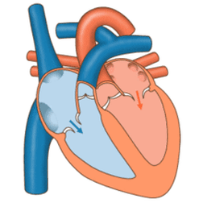

???

The heart is a muscular organ that consists of two atria and two ventricles. 

The right-atrium receives the blood from the veins and sends it to the right ventricle. From there the blood is sent to the lungs to become oxygenated.

The oxygen-rich blood is then sent to the rest of the body by the contractions of the left ventricle.

The ideal flow of the blood depends mainly on the function of the four valves of the heart which ensure that blood unrestrictedly flows in the right direction through the heart.

---

# Heart Function & Disease


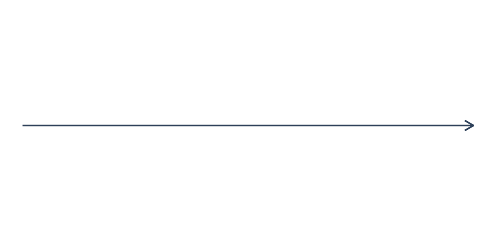


???

This ideal flow of the blood, however, may be disrupted, causing our health to deteriorate and increase our risk of dying. Unfortunately, there are several causes for such disruptions such as:

---

# Heart Function & Disease


<div style = "position: absolute; right: 650px; bottom: 300px; align: center">
<p align = 'center'>
<span style = "font-family: proxima-nova, sans-serif; color: #2d4059; font-size = 28px;">
Congenital <br>Heart <br> Disease <br> (CHD)
</span>
</p>
</div>

???

Congenital Heart Disease, which is the most common type of congenital disability and refers to a broad spectrum of defects and symptoms.

---

# Heart Function & Disease


<div style = "position: absolute; right: 650px; bottom: 300px; align: center">
<p align = 'center'>
<span style = "font-family: proxima-nova, sans-serif; color: #2d4059; font-size = 28px;">
Congenital <br>Heart <br> Disease <br> (CHD)
</span>
</p>
</div>

<div style = "position: absolute; right: 500px; bottom: 200px; align: center">
<p align = 'center'>
<span style = "font-family: proxima-nova, sans-serif; color: #2d4059; font-size = 28px;">
Heart <br>Failure 
</span>
</p>
</div>

???

and Heart Failure, a chronic progressive condition in which the heart cannot fulfill the body's needs for blood and oxygen. 

---

class: section-title, middle, center

# MOTIVATION
## Datasets

???

While Congenital Heart Disease and Heart failure are only two such examples, they may lead to a broad range of complications and health risks. 

Let me, therefore, describe in a bit more detail two of the studies that motivated our research and concern patients suffering from these two diseases . 

---

# Pulmonary Valve

.pull-left[

- <b>CHD</b>:

  - 20% $\rightarrow$ RVOT complications: pulmonary atresia, pulmonary valve stenosis, tetralogy of fallot

  - RVOT reconstruction with a <b>pulmonary valve replacement</b>
]

???

The first study focuses on the pulmonary valve.

1 out of 5 Congenital Heart Disease patients may suffer from complications with the Right Ventricular Outflow Tract such as 

- <b>pulmonary atresia</b>: a birth defect where the pulmonary valve does not fully form. 

- <b>pulmonary valve stenosis</b>: a narrowing of the pulmonary valve that disrupts the blood flow.

- <b>tetralogy of fallot</b>: which is characterized by four defects including stenosis of the pulmonary valve.  


These patients will most likely undergo Right Ventricular Outflow Tract reconstruction with a pulmonary valve replacement. 

---

# Pulmonary Valve

.pull-left[

- <b>CHD</b>:

  - 20% $\rightarrow$ RVOT complications: pulmonary atresia, pulmonary valve stenosis, tetralogy of fallot

  - RVOT reconstruction with a <b>pulmonary valve replacement</b>

- <b>ROSS patients</b>: 

  - Pulmonary valve used as a transplant for the aortic valve

  - <b>Pulmonary valve replacement</b> needed for the pulmonary position.
]

???

<b>Pulmonary valve replacement</b> is also needed for ROSS patients as according to the ROSS procedure their own pulmonary valve is used as a replacement for their diseased aortic valve. 

That means that a substitute is then needed for the pulmonary position. 

---

# Pulmonary Valve

.pull-left[

- Pulmonary valve replacements do not last forever. 

- Echocardiographic follow-up to measure the pulmonary gradient.

- More than one replacements might be necessary during lifetime:

  - Too early: $\rightarrow$ more replacements necessary
  - Too late: $\rightarrow$ increased risk of dying
]

???

These pulmonary valve replacements may not last forever and additional valve replacements might be necessary for these patients in the future. 

Therefore, these patients are monitored closely over time. Measures such as their pulmonary gradient, a measure of the pressure with which the blood flows through the pulmonary valve are being recorded over time in order to assess whether additional interventions are necessary.

The timing of such interventions is crucial as if done too early then more replacements might be needed while if done too late the risk of dying increases.

---

# Heart Failure 


.pull-left[

- High Risk of complications: thrombosis, embolic events, dialysis.

- Liver function $\rightarrow$ monitor total bilirubin

- Kidney function $\rightarrow$ monitor creatinine

- Left Ventricular Assist Device (LVAD).

]

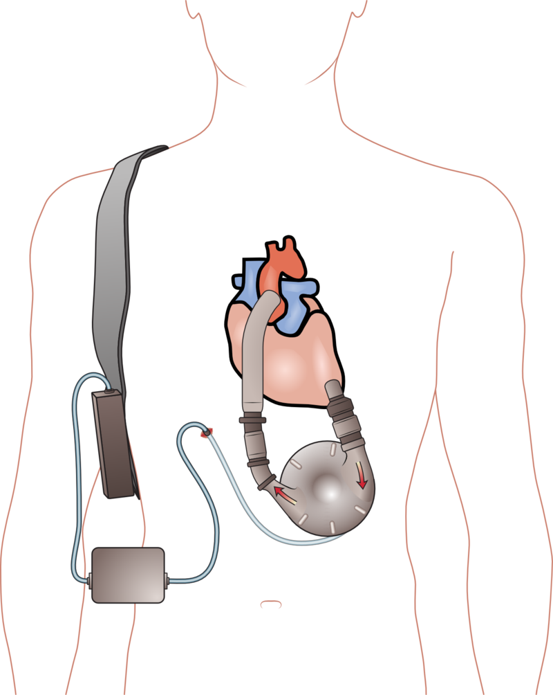

???

The second study concerns heart failure.

End-stage heart failure patients are under high risk of several and serious complications such as thormbosis, embolic events and dialysis.

Treating physicians follow these patients closely and collect biomarker measurements for their liver and kidney function and may consider to intervene with a Left Ventricular Assist Device.

This device takes over the heart function and is also used as a bridge therapy while waiting for a heart transplant.

While the Left Ventricular Assist Device considerably increases the chance of survival for these patients it might also increase the risk for complications. 

It is therefore very important to understand the impact of this device at different stages after heart failure in order to improve the health management of these patients.

---

class: section-title, middle, center

# MOTIVATION
## Joint Modeling

???

While the two examples I described, sound and are very different in clinical terms, they also have a lot of features in common, when viewed from a statistical point of view. Let me explain what I mean.  

---

# General idea

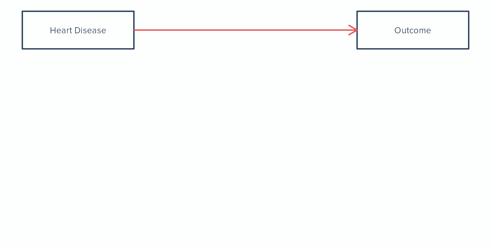

???

In both situations we are dealing with a disease which may increase the risk for a negative healt related outcome. 

---

# General idea

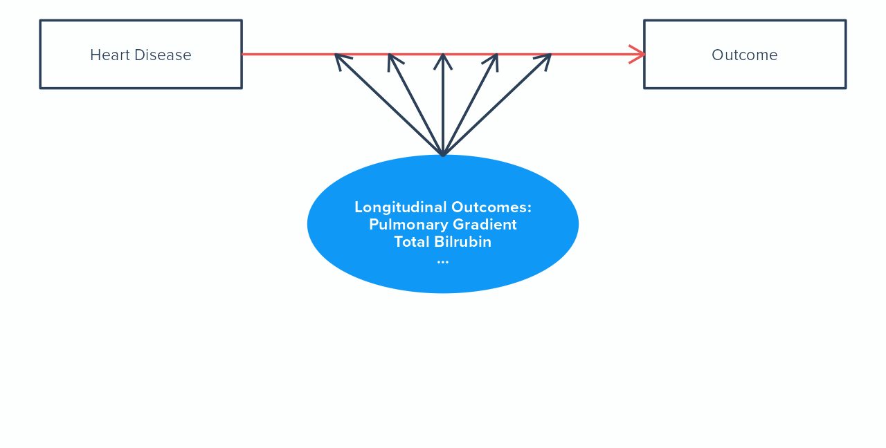


???

As soon as we diagnose the problem, we closely follow-up the patients and repeatedly monitor longitudinal outcomes that are predictive of their risk, and can help us manage these patients better and prevent negative outcomes for their health.

---

# Joint Model 

<center>

</center>

???

Risk is a continuous function that changes over time. It can increase, decrease or stay constant depending on other factors.

---

# Joint Model 

<center>
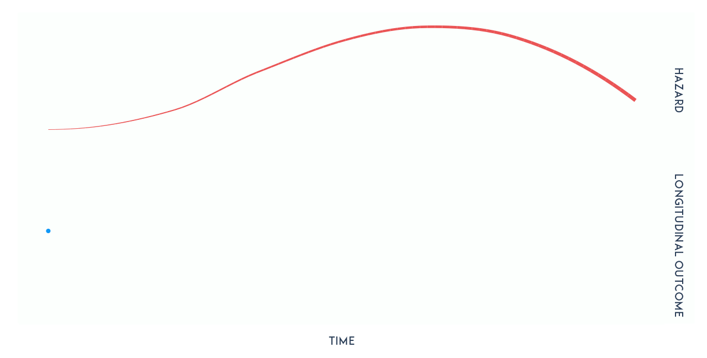
</center>

???

As we cannot measure risk directly itself, we monitor other markers repeatedly over time which we believe can help us estimate that risk as they are closely associated with it. 

However, these repeated measurements are subject to measurement error and are only fragments, snapshots of a continuous process that may change faster than we are able to measure it. 

---

# Joint Model 

<center>
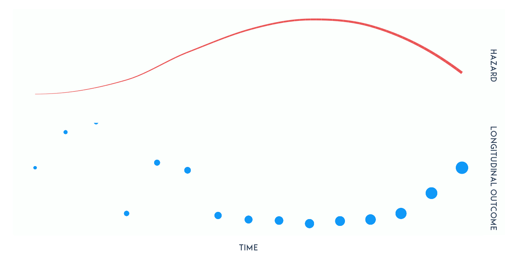
</center>

???

We therefore use a specific class of statistical models, the mixed-effects models, to estimate the true underlying subject-specific trajectory as a continuous function of time.  

By doing so, we not only account for the measurement error but also for the fact that measurements from the same subjects are potentially more similar than measurements from different subjects.

---

# Joint Model 

<center>
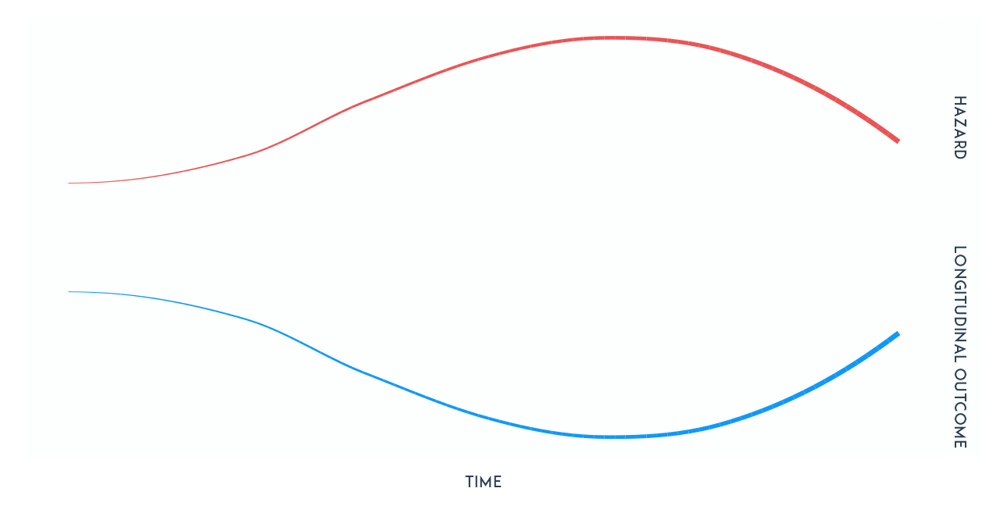
</center>

???

After recovering the true underlying trajectory of the longitudinal outcome we need to think of a way to link it to the risk. There are several options for doing so.

---

# Joint Model 

<center>
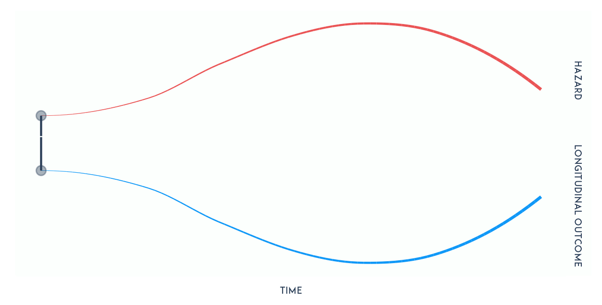
</center>

???

We can assume that the value of the the longitudinal outcome at each time point is associated with the risk at that same time point.

This could mean that higher values of the longitudinal outcome translate to higher risk in the case of a positive association, for example.

---

# Joint Model 

<center>
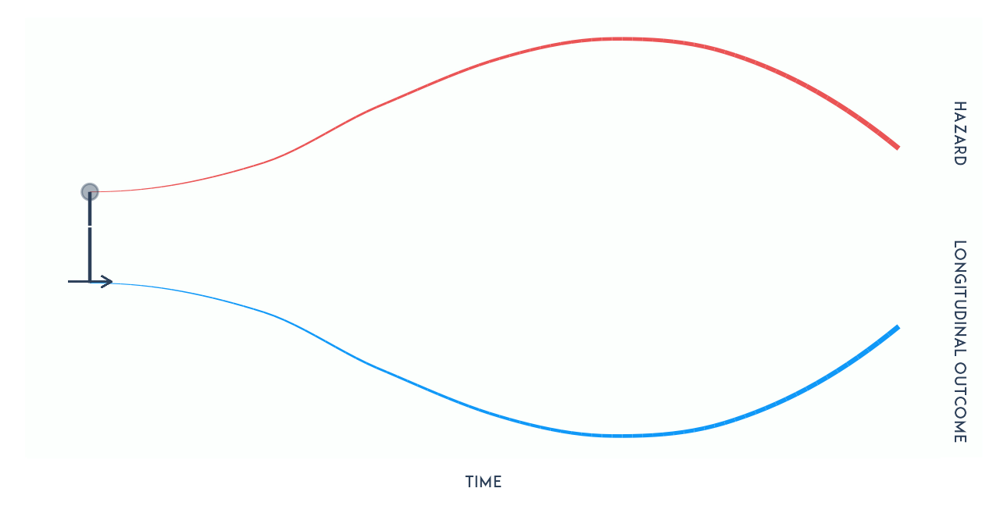
</center>

???

Another option is to assume that the rate of increase or decrease of the longitudinal outcome at each time point, is associated with the risk at that same time point.

This means that the speed in which the longitudinal outcome changes can tell us something about the risk.

---

# Joint Model 

<center>
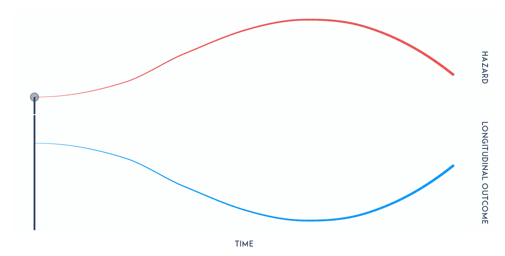
</center>

???

Finally, in other situations it might be more accurate to assume that the risk at a certain time point is associated with the area under the trajectory of the longitudinal outcome up to that time point.

The area under the curve can also be viewed as the overall burden as it summarizes the whole history of the marker up to a specific time-point.

---

# Dynamic Prediction

<center>
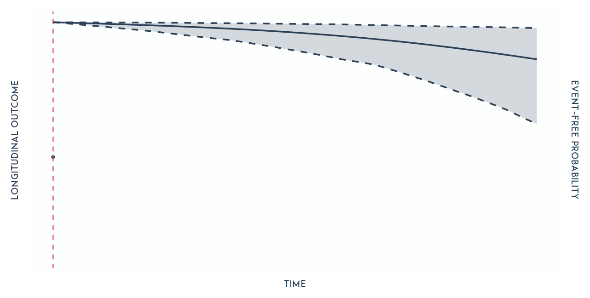
</center>

???

After the form of the association between the two processes is established, we can use our estimates to predict the risk for new patients. 

Most importantly we can do so dynamically as time is incorporated in our models. That is with every new measurement of the longitudinal outcome we can update our prediction for the risk accordingly. 

Let me now highlight the contents of some of the chapters of my dissertation which concern extensions of the joint modeling framework I just outlined and applications to the datasets I briefly introduced.

---

class: section-title, middle, center

# PART I
## INTERMEDIATE EVENTS

???

PART I deals with the occurrence of intermediate events. 

---

# Pulmonary Valve & RE-OPERATION

<center>
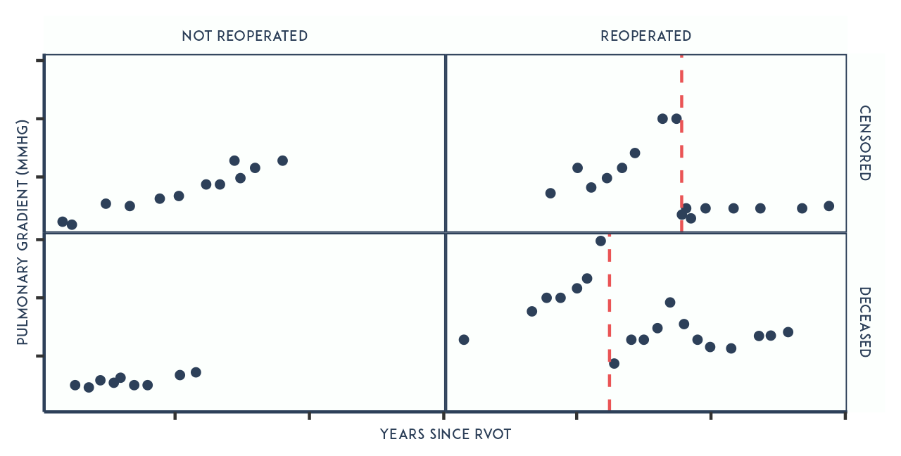
</center>

???

Let's go back to the pulmonary valve dataset and the measurements of the pulmonary gradient. 

What we observe here is that the pulmonary gradient of these patients is increasing over time. 

When it becomes too high this is an indication that an additional valve replacement might be necessary.

After this re-operation the pulmonary gradient drops back to normal levels.

In this case re-opereation is an intermediate event that changes the trajectory of the longitudinal outcome and reduces the risk of dying.

---

# Pulmonary Valve & RE-OPERATION

<center>

</center>

???

We therefore adapt the mixed-model accordingly so it is able to capture these changes under different scenarios regarding re-operation. 

That means that the true underlying trajectory of the pulmonary gradient will change after the occurrence of the intermediate event and will drop back to normal levels.

---


# Dynamic & Adaptive Predictions 

<center>
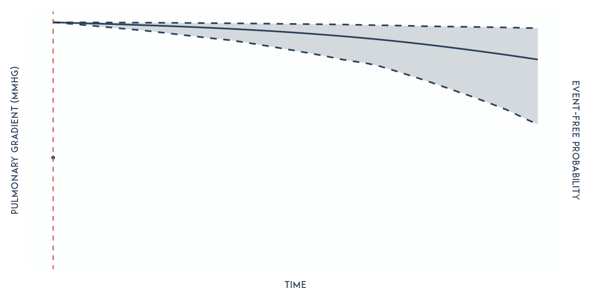
</center>

???

By capturing these changes with respect to the intermediate events we can now create dynamic prediction tools that are not only dynamic, in the sense that they can be updated with every new measurement but also adaptive to different scenarios regarding the occurrence of intermediate events in the future such as re-operation in this case.

---

# Predictive Performance 

<center>
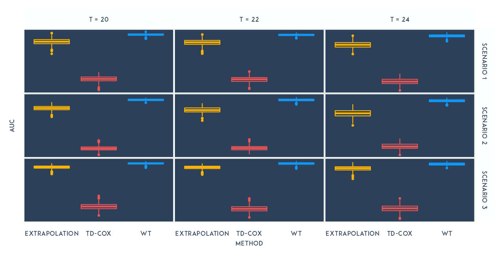
</center>

???

Finally we also showed via an extensive simulation study, the added benefit in the quality and accuracy of predictions when such intermediate events are incorporated in the model.

---

class: section-title, middle, center

# PART II
## MULTI-STATE MODELS & SHRINKAGE

???

PART II deals with multiple-event states and the use of shrinkage for the selection of the association structure between the multi-state and longitudinal processes.

---

# Multiple states

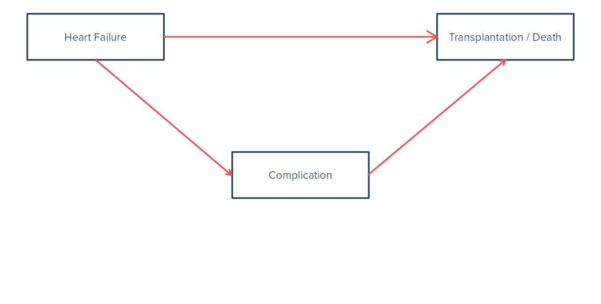

???

Sometimes, as is the case with the heart failure we are interested to study the risk of transitioning to multiple health states of interest. 

In this case for example we are interested to study the transitions from heart failure to death or transplantation, from heart failure to complications and to transplantation or death after experiencing complications.

---

# Multiple states and Intermediate Events


???

An intermediate event can still occur. In this case, intervention with an LVAD is considered as an intermediate event and can happen at any point changing the trajectories of the longitudinal markers and the risk for each transition.

---

# Modeling

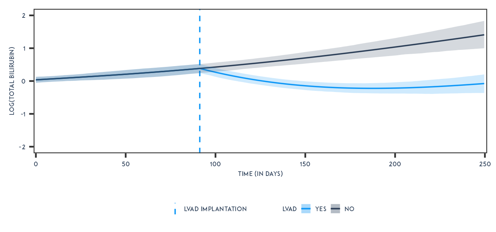

???

We therefore specify our model accordingly to capture these changes in the longitudinal markers. In this case it seems that LVAD implantation reduces total bilrubin,

---

# Modeling

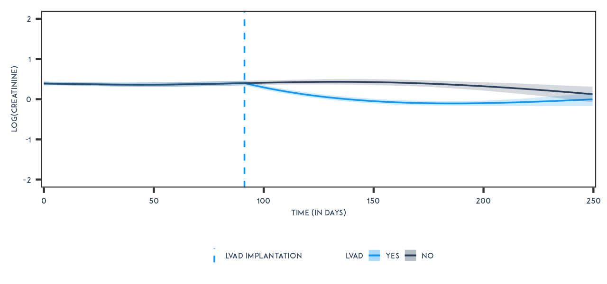

???

Same holds for creatinine which however seems to increase back to the pre-LVAD levels over time.

---

# Feature selection

.pull-left[

- Challenges:
  - Multiple longitudinal outcomes
  - Multiple transitions
  - Which association structure to choose between the two?
  
]

<div style="background: #fcfffd; 
            font-size: 26px;
            padding: 10px; 
            border: 4px solid #1098f7; 
            margin: 5px; 
            position: absolute; 
            top: 400px;
            right: 240px;
            text-align: center">
<span style = 'color: #2d4059;'>#Longitudinal Outcomes &#215 #Transitions &#215 #Association Structures</span>
</div>

???

After modeling the longitudinal outcomes we need to link them to the risk with each transition.

This creates an additional challenge in this case as now the number of parameters that describe the association structure can become high.

For example if we have three candidate structures: the value, the rate of change and the area under the longitudinal trajectory, but for two longitudinal outcomes and for each transition, we end up with 18 association parameters in total making the selection of the association structure challenging.

---

# Feature selection

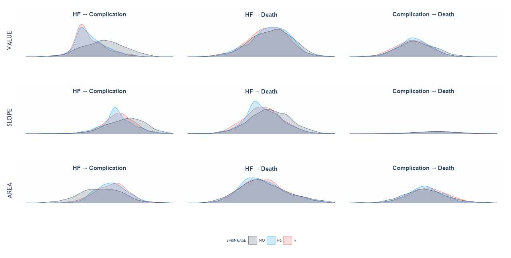

???

We therefore proposed and investigated the use of Bayesian shrinkage priors as a method to automate and aid in the selection of these features.

---

class: section-title, middle, center

# PART III
## MISSING DATA

???

In PART III of the dissertation we looked at missing data in this context

---

# PART III: MISSING DATA

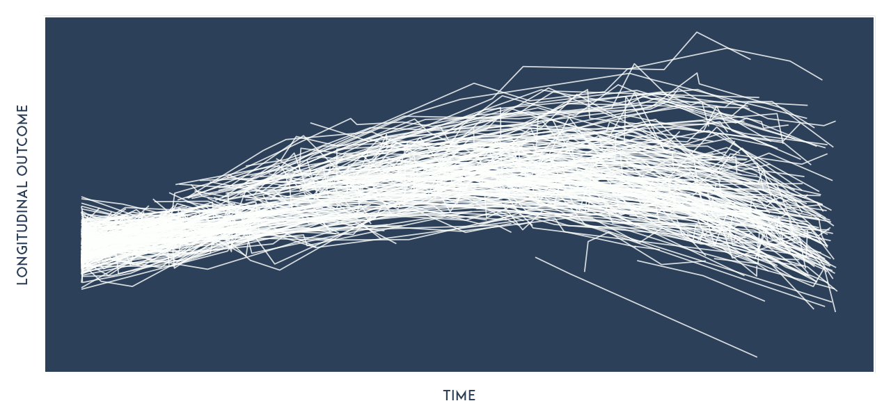


???

In follow-up studies ideally we want to have complete information for every subject included in the study.


---

# PART III: MISSING DATA

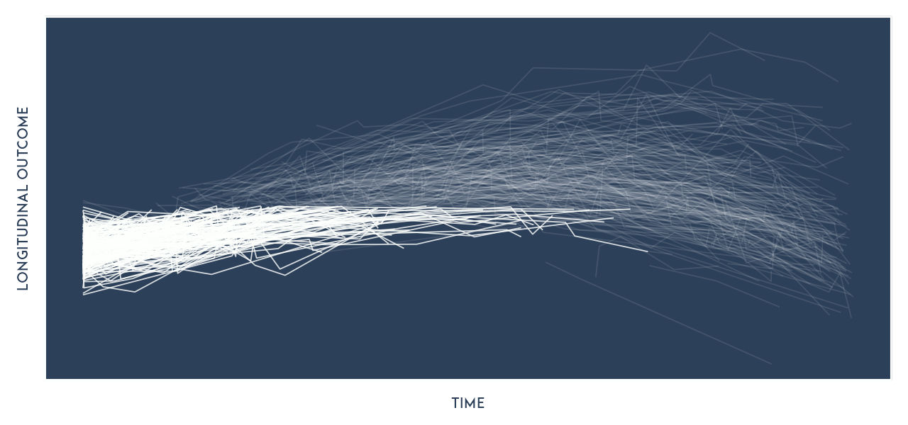


???

However, this rarely happens as patients will drop-out from a study for many reasons such as moving to another country or due to their own decision because of side-effects for example.

This means that we only have partial information at hand instead of the full information.

---

# PART III: MISSING DATA

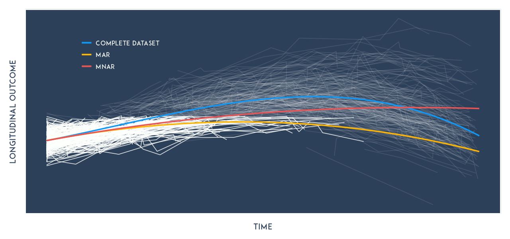

???

Unfortunately, as the missing data can never be recovered we have to rely on plausible assumptions regarding the reasons that data are missing.

Different assumptions will lead to different conclusions and as we can never be sure which assumption is correct we have to explore all possibilities with sensitivity analysis.

---

# PART III: MISSING DATA

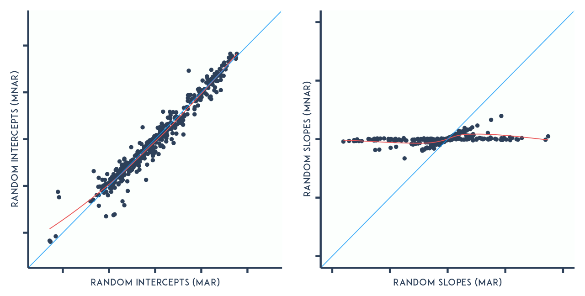


???

In this context we used joint models for longitudinal and time-to-event data as a tool for sensitivity analysis.

We discussed how these models can be used to investigate different scenarios for the causes of missingness on the subject-specific level.

Our results indicated minimal sensitivity in parameter estimates and standard deviations but differences in subject-specific predictions.

This means that while our inference on the population level is more robust across different assumptions on the causes of missingness, this does not hold when we are interested in predictions for each individual. 

---

class: section-title, middle, center

## SOFTWARE IMPLEMENTATION

???

Finally, for our methods to be useful and most importantly accessible in practice we implemented them in R packages: JMbayes and JMbayes2.   

---

# SOFTWARE IMPLEMENTATION


<div style="background: #fcfffd; 
            font-size: 20px;
            padding: 10px; 
            position: absolute; 
            top: 480px;
            right: 400px;
            text-align: center; 
            font-family: proxima-nova, sans-serif;">
<span style = 'color: #2d4059;'>D. Rizopoulos, G. Papageorgiou, P.M. Afonso</span>
</div>

???

JMbayes2, our latest work is

available for download from The Comprehensive R Archive Network and GitHub. It also has its own website with detailed documentation and tutorials to make it more accessible to everyone.

---

class: title-slide  


???

Thank you for your attention. I give the word back to you now, Sir/Madam Rector.

<!-- # PART III: MISSING DATA -->

<!-- <div style="background: #fcfffd;  -->
<!--             font-size: 20px;  -->
<!--             padding: 10px;  -->
<!--             border: 4px solid #2d4059;  -->
<!--             margin: 10px;  -->
<!--             position: absolute;  -->
<!--             top: 300px; -->
<!--             right: 300px; -->
<!--             text-align: center"> -->
<!-- <span style = 'color: #1098f7'>Mininmal sensitivity in parameter estimates and standard deviations</span> <br><span style = 'color: #ea5455'>but difference in subject-specific predictions.</span> -->
<!-- </div> -->

<!-- ??? -->

<!-- PART III deals with missing Data -->


